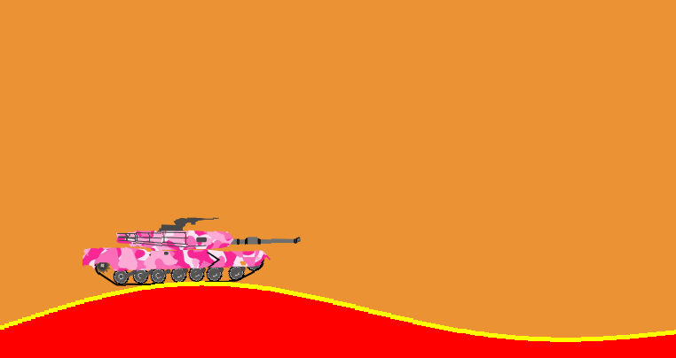

# Pygame tank

An educational project created with help of two frameworks: `pygame` and `pymunk`. 
The tank is able to move forward and backward (`w`/`d`), shoot (`whitespace`) and 
change the elevation of the main gun (`key_up`/`key_down`).

# How to launch the game
- Clone this repo
- Create a virtual environment (`virtualenv ./env`)
- Activate the virtual environment (`source ./env/bin/activate`)
- Install dependencies (`pip install -r requirements.txt`)
- Play (`python main.py`)

# Screenshot
